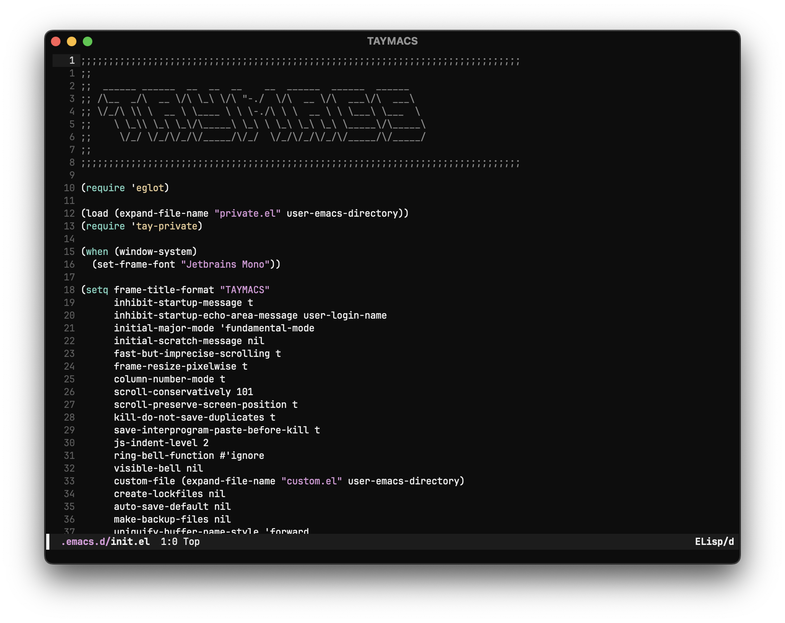

```
                                                            
  ______ ______  __  __  __    __  ______  ______  ______
 /\__  _/\  __ \/\ \_\ \/\ "-./  \/\  __ \/\  ___\/\  ___\ 
 \/_/\ \\ \  __ \ \____ \ \ \-./\ \ \  __ \ \ \___\ \___  \ 
    \ \_\\ \_\ \_\/\_____\ \_\ \ \_\ \_\ \_\ \_____\/\_____\
     \/_/ \/_/\/_/\/_____/\/_/  \/_/\/_/\/_/\/_____/\/_____/
                                                            
                                                            
```

taylor's emacs config.



---

modern emacs is pretty awesome and for my use doesn't need a ton of customization to
get to the same level as "modern" editors. this is my very simple setup with as few
external packages as possible.
